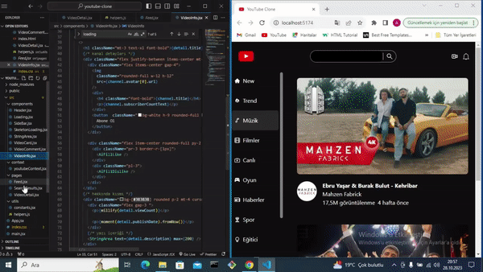

# Youtube-Clone

# Kullanılan Teknolojiler

- react-icons
- react-router-dom
- axios
- millify
- moment
- react-player
- tailwind

# Açıklama

- Stillendirme için Tailwind css , sayfa geçişleri için React-router Dom ,Enpoint istekleri için Axios ,Componentler arasındaki verileri aktarmak için context yapılarını kullandım.

# Kaynaklar

- API: https://rapidapi.com/ytjar/api/yt-api

<h2>Ekran goruntusu</h2>

